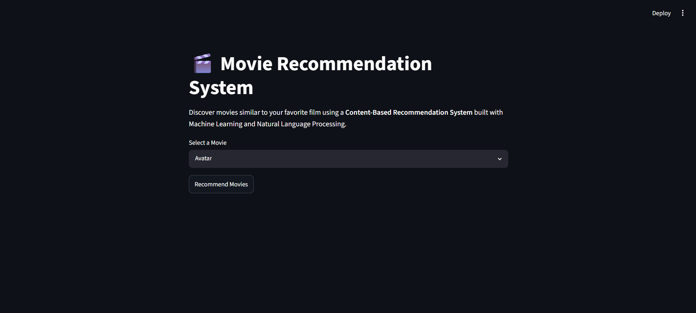
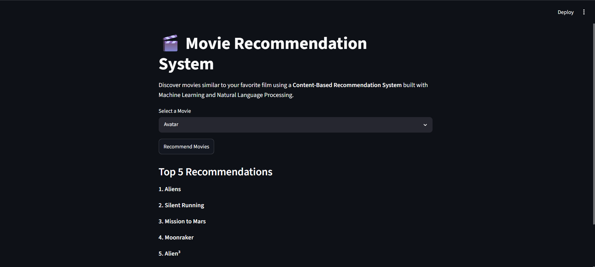

# 🎬 Movie Recommendation System

A **Content-Based Movie Recommendation System** built using **Python, Scikit-learn, Natural Language Processing (NLP), and Streamlit**. The system recommends movies similar to a selected movie by analyzing metadata such as genres, keywords, cast, director, and movie overview. It utilizes machine learning techniques to compute similarity scores and provide personalized movie recommendations through an interactive web application.

---

## Project Overview

Recommendation systems are widely used by streaming platforms such as Netflix, Amazon Prime Video, Disney+, and Spotify to improve user experience by suggesting relevant content.

This project implements a **Content-Based Recommendation System**, where recommendations are generated by comparing movie attributes rather than relying on user ratings or collaborative filtering. Each movie is represented as a feature vector created from its metadata, and similar movies are identified using **Cosine Similarity**.

The project demonstrates the complete machine learning workflow including data preprocessing, feature engineering, vectorization, similarity computation, model serialization, and deployment using Streamlit.

---

## Problem Statement

Given a movie selected by the user, recommend the **Top 5 most similar movies** based on their content.

The recommendation is generated using:

- Movie Genres
- Keywords
- Cast Members
- Director
- Movie Overview

rather than popularity or user ratings.

---

## Dataset

**Dataset:** TMDB 5000 Movie Dataset

The project uses two datasets:

- `tmdb_5000_movies.csv`
- `tmdb_5000_credits.csv`

After preprocessing, both datasets are merged to create a unified dataset containing movie metadata required for recommendations.

---

## Project Workflow

```
Load Dataset
      │
      ▼
Merge Movies & Credits
      │
      ▼
Data Cleaning
      │
      ▼
Feature Engineering
      │
      ▼
Text Preprocessing
      │
      ▼
Count Vectorization
      │
      ▼
Cosine Similarity
      │
      ▼
Recommendation Engine
      │
      ▼
Streamlit Web Application
```

---

## Key Features

- Content-Based Movie Recommendation System
- Natural Language Processing (NLP)
- Metadata-based Similarity Matching
- Feature Engineering
- Text Vectorization using CountVectorizer
- Cosine Similarity Recommendation Engine
- Interactive Streamlit Web Application
- Serialized Machine Learning Model using Pickle

---

## Technologies Used

| Category | Technologies |
|----------|--------------|
| Programming Language | Python |
| Data Processing | Pandas, NumPy |
| Machine Learning | Scikit-learn |
| NLP | NLTK |
| Web Application | Streamlit |
| Model Serialization | Pickle |
| Version Control | Git & GitHub |

---

## Project Structure

```
Movie-Recommendation-System
│
├── app/
│   └── app.py
│
├── data/
│   ├── tmdb_5000_movies.csv
│   └── tmdb_5000_credits.csv
│
├── images/
│   ├── homepage.png
│   └── recommendations.png
│
├── models/
│   ├── movies.pkl
│   └── similarity.pkl
│
├── notebooks/
│   └── movie_recommendation.ipynb
│
├── requirements.txt
├── .gitignore
└── README.md
```

---

## Data Preprocessing

The following preprocessing steps were performed before building the recommendation model:

- Merged the Movies and Credits datasets.
- Selected only relevant columns.
- Removed missing values.
- Removed duplicate records.
- Extracted useful information from nested JSON columns.
- Created a combined textual feature for each movie.

---

## Feature Engineering

The recommendation engine uses the following movie attributes:

- Genres
- Keywords
- Top 3 Cast Members
- Director
- Movie Overview

All features are combined into a single **tags** column which represents each movie.

Example:

```
overview
+
genres
+
keywords
+
cast
+
director
=
tags
```

---

## Natural Language Processing (NLP)

To improve recommendation quality, several NLP preprocessing techniques were applied.

### Text Tokenization

Movie overviews were converted into individual words.

### Removing Spaces

Multi-word entities such as

```
Science Fiction
```

were converted into

```
ScienceFiction
```

to preserve them as single features.

### Stemming

NLTK's Porter Stemmer was used to reduce words to their root forms.

Example:

```
Loved
Loving
Loves

↓

Love
```

This reduces feature redundancy and improves similarity matching.

---

## Machine Learning Methodology

The recommendation engine follows the steps below:

### Step 1

Convert movie metadata into textual features.

### Step 2

Generate numerical feature vectors using **CountVectorizer**.

```
Movie Tags
      │
      ▼
CountVectorizer
      │
      ▼
5000-Dimensional Feature Vector
```

### Step 3

Compute similarity between every pair of movies using **Cosine Similarity**.

### Step 4

Sort similarity scores in descending order.

### Step 5

Return the **Top 5 most similar movies**.

---

## Application Preview

### Home Page



---

### Recommendation Result



---

## Sample Recommendation

**Selected Movie**

```
Avatar
```

**Recommended Movies**

1. Aliens
2. Silent Running
3. Mission to Mars
4. Moonraker
5. Alien³

---

## Skills Demonstrated

- Python Programming
- Data Cleaning
- Data Preprocessing
- Feature Engineering
- Natural Language Processing
- Machine Learning
- Recommendation Systems
- Cosine Similarity
- Scikit-learn
- Streamlit
- Git & GitHub

---

## Installation

Clone the repository.

```bash
git clone https://github.com/harshitbehal2611-web/Movie-Recommendation-System.git
```

Move into the project directory.

```bash
cd Movie-Recommendation-System
```

Install the required dependencies.

```bash
pip install -r requirements.txt
```

Run the Streamlit application.

```bash
streamlit run app/app.py
```

---

### Generate Model Files

After cloning the repository, run the Jupyter notebook once to generate the model files:

- `movies.pkl`
- `similarity.pkl`

These files are excluded from the repository because the similarity matrix exceeds GitHub's file size limit.

---

## Future Improvements

- Display movie posters using the TMDB API.
- Add movie ratings and release year.
- Show movie trailers.
- Implement fuzzy search for movie names.
- Recommend more than five movies.
- Add genre-based filtering.
- Deploy the application on Streamlit Cloud.

---

## Author

**Harshit Behal**

GitHub: https://github.com/harshitbehal2611-web

---

## License

This project is intended for educational and portfolio purposes.
